# GPT2Image-Pro 项目架构与交接手册

> 职责：给接手开发、架构评审和改造实施提供当前代码事实总览。
> 快照日期：2026-07-10。
> 代码基线：`2aa2536e7d6cb5c6f426fed46fa30aafc4a62307`。
> 配套文档：[项目模型目录](PROJECT-MODEL-CATALOG.md)、
> [交接改造技术方案](plan/2026-07-10-project-handover-refactor.md)。

## 1. 阅读约定

本文把信息分成三类，交接时不得混用：

- **当前实现**：已在本快照代码、迁移或运行配置中落地。
- **目标架构**：`AGENTS.md` 和 UOL 设计要求的新功能演进方向。
- **改造建议**：基于现状提出的实施顺序，不代表已经完成。

现有 `docs/plan/` 中包含历史计划和未来方案。例如多应用、多域名拆分仍是
计划，不是当前部署形态。判断事实的优先级是：当前代码与迁移、CI 配置、最新
实施记录、历史计划。

## 2. 执行摘要

GPT2Image-Pro 是一个面向 AI 图像、视频和可编辑文件生成的 SaaS 平台。当前形态是
**Next.js 模块化单体 + PostgreSQL 状态中心 + 两个 Go Sidecar**：

1. `apps/web` 同时承载公开站、登录后台、管理后台、Server Action、REST API、
   OpenAI 兼容 API、MCP、Cron 入口、内置调度器和异步 Worker。
2. `packages/shared` 承载跨应用业务服务、鉴权、积分、订阅、支付、存储、审核、
   UOL 和部分 React 组件，不是严格的纯领域包。
3. `packages/database` 是 Drizzle Schema、数据库连接和 SQL 迁移的权威来源。
4. `packages/ui` 是 Radix/Shadcn 风格的无业务 UI 原语层。
5. `services/chatgpt-web-proxy` 负责特殊 TLS 指纹和上游会话转发；
   `services/chatgpt-register` 负责 Wine 注册机执行。两者不进入 pnpm workspace。

系统已经具备三条不可复制的业务核心：

- 图像：`runImageGenerationForUser`。
- 视频：`runAdobeVideoGenerationForUser`。
- PPT/PSD：`runEditableFileForUser`。

UOL 统一操作层已经具备 Registry、Principal、权限、Zod 输入输出、能力位、幂等
声明和统一错误，但页面、Action 和 API 仍有大量直连 service 或 DB 的旧路径。因此，
当前准确描述是“**统一接口层迁移中**”，不是“所有功能已经 UOL 化”。

## 3. 规模基线

| 指标 | 当前值 | 事实来源 |
| --- | ---: | --- |
| pnpm 应用 | 1 | `apps/web` |
| workspace 包 | 3 | database、shared、ui |
| Go Sidecar | 2 | proxy、register |
| TypeScript/TSX 文件 | 799 | `apps/`、`packages/` 静态盘点 |
| Vitest 测试文件 | 175 | Web 107、Shared 68 |
| Next 页面 | 34 | `page.tsx` |
| Next Route Handler | 58 | `route.ts` |
| PostgreSQL 表 | 44 | `packages/database/src/schema.ts` |
| PostgreSQL 枚举 | 11 | 同上 |
| SQL 迁移 | 63 | `0000` 至 `0062` |
| UOL Operation | 172 | `packages/shared/src/uol/operations/` |
| UOL 直接实现 | 83 | Operation 定义内直接 execute |
| UOL Web 延迟绑定 | 12 | `apps/web/src/server/uol-bindings.ts` |
| UOL 尚未接线 | 77 | 89 个 stub 扣除 12 个延迟绑定 |

以上数字是快照，不应硬编码到运行逻辑。它们用于衡量交接和改造范围。

## 4. 技术栈

| 层级 | 技术 | 用途与边界 |
| --- | --- | --- |
| Monorepo | pnpm 10.27、Turborepo 2.9 | workspace、缓存、任务依赖 |
| 运行时 | Node.js 22，Go 1.24 | Web/Worker 与 Sidecar |
| Web | Next.js 16.2、React 19.2 | App Router、RSC、Route Handler |
| 语言 | TypeScript 5 strict、ES2022 | `noUncheckedIndexedAccess`、`exactOptionalPropertyTypes` 等 |
| UI | Tailwind CSS 4、Radix UI、Lucide | 业务界面与共享原语 |
| 表单与契约 | Zod 4、React Hook Form、next-safe-action | 输入验证、Action 中间件 |
| 数据库 | PostgreSQL 16、Drizzle ORM 0.45 | 权威状态、事务、租约、账本 |
| 数据库连接 | `pg` Pool、Neon WebSocket Pool | 本地/Docker 与 Neon 两种模式 |
| 鉴权 | Better Auth | 邮箱密码、GitHub/Google OAuth、会话 |
| 国际化 | next-intl | locale 路由与中英文消息 |
| 内容 | Fumadocs MDX | Docs、Blog、Legal |
| 图像处理 | Sharp、ONNX Runtime、ag-psd | 超分、修复、抠图、PSD |
| 存储 | S3 兼容或本地文件 | 预签名直传、产物托管 |
| 支付 | Creem、Epay、Alipay | 订阅、积分包、Webhook 履约 |
| 审核 | Aliyun、OpenAI、审核代理 | 文本/图片审核，默认 fail-closed |
| 限流 | Upstash Redis、内存降级 | 多副本应强制配置 Redis |
| 日志与监控 | Pino、Sentry、Prometheus、Web Vitals | 日志、错误、指标、前端体验 |
| 测试 | Vitest、Lighthouse、PG 迁移门禁 | DB-free 单测、性能、真实迁移 |
| 代码质量 | Biome、TypeScript | lint、类型、格式约束 |
| 部署 | Docker Compose、GHCR、Nginx 蓝绿 | 单机标准部署和环境专用蓝绿 |

关键配置入口：根 [package.json](../package.json)、[turbo.json](../turbo.json)、
[tsconfig.base.json](../tsconfig.base.json)、[biome.json](../biome.json)、
[apps/web/package.json](../apps/web/package.json)。

## 5. 工程结构

```text
GPT2Image-Pro/
├── apps/web/
│   ├── src/app/                 页面、布局、API、Webhook、MCP
│   ├── src/features/            按业务域组织的组件与应用服务
│   ├── src/server/              UOL 绑定、调度、租约、指标
│   ├── src/i18n/                locale 路由和消息加载
│   ├── src/content/             Docs、Blog、Legal MDX
│   └── models/                  ONNX 本地推理模型
├── packages/database/
│   ├── src/schema.ts            44 张表和枚举
│   ├── src/index.ts             PG/Neon 连接
│   └── drizzle/                 手写 SQL 迁移与 journal
├── packages/shared/
│   ├── src/uol/                 统一操作层
│   ├── src/auth/                鉴权、角色、注册
│   ├── src/credits/             积分账本
│   ├── src/subscription/        套餐与能力矩阵
│   ├── src/payment/             支付适配
│   ├── src/storage/             存储适配
│   ├── src/moderation/          内容审核
│   ├── src/mcp/                 MCP 工具与鉴权
│   └── src/system-settings/     运行时配置中心
├── packages/ui/                 通用 UI 原语和样式
├── services/                    两个独立 Go Sidecar
├── tools/                       Adobe Cookie 浏览器扩展
├── scripts/                     迁移、发布、性能、冒烟脚本
└── docs/                        设计、实施记录、审计和长期记忆
```

### 5.1 包依赖方向

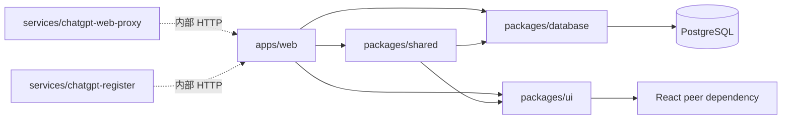

允许方向是 `web -> shared/database/ui`、`shared -> database/ui`。
`database` 和 `ui` 不得向上依赖。`shared` 不能导入 `apps/web`，因此依赖 Web service
的 Operation 通过 `bindExecute` 延迟绑定。

当前不是严格六边形架构：`apps/web` 与 `packages/shared` 都有直接 DB 访问，
`packages/shared` 还包含 Next、React、UI 和 Server Action。改造时应渐进收敛，不能
假设已经存在纯 Domain/Repository 分层。

## 6. 系统上下文与运行时组件

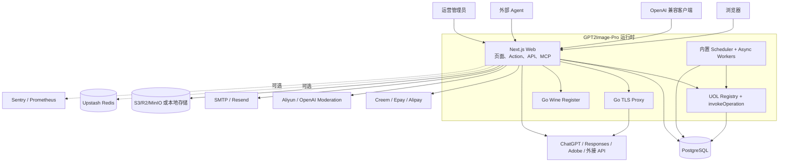

### 6.1 Next.js 边界

- 根布局保持静态能力；公开 locale 页面使用 60 秒 ISR。
- Dashboard 子树强制动态，页面服务端再次校验会话和角色。
- `apps/web/src/proxy.ts` 负责 i18n、粗粒度跳转、选择性限流和私有缓存头。
- Proxy 只检查登录 Cookie 是否存在，不是授权真相。资源归属和管理员权限必须由
  页面、Action、Handler 或 UOL 再次校验。
- 大正文路由绕开 Proxy 匹配，避免请求体被额外缓冲。

### 6.2 启动顺序

`apps/web/src/instrumentation.ts` 在 Node runtime 中按顺序启动：

1. 系统设置 bootstrap。
2. 自用模式超级管理员 bootstrap。
3. 内置任务调度器。
4. 可编辑文件、生成任务和回调 Worker。
5. Sentry 服务端初始化。

这一形态要求常驻 Node 进程。若迁往纯 Serverless，Scheduler 和 Worker 必须拆成独立
常驻部署，不能继续依赖 Next instrumentation。

## 7. 入口与路由地图

### 7.1 页面入口

| 区域 | 页面 | 主要实现 |
| --- | --- | --- |
| 认证 | sign-in、sign-up、forgot/reset password | `features/auth` |
| 营销 | 首页、pricing、blog、legal、pSEO | marketing 路由组 |
| 文档 | `/[locale]/docs/*` | Fumadocs MDX |
| 创作 | create、canvas | image-generation、infinite-canvas |
| 作品 | gallery、history | generation/video 查询与 PSD 导出 |
| 商业 | billing、credits/buy、referral | payment、credits、referral |
| 设置 | settings、external-api | 用户、API Key、MCP Key、上游配置 |
| 运营 | announcements、support、backend-help | 公告、工单、系统文档 |
| 管理 | admin/status、users、payments、referral、settings | 管理 Action 和聚合查询 |

统一创作页不是单一表单，而是文生图、图生图、Chat、Agent、Waterfall、Video、
PPT/PSD 的组合工作台。无限画布最终仍调用相同的图像 API，没有第二条图像业务核心。

### 7.2 API 入口

| 入口 | 鉴权 | 作用 |
| --- | --- | --- |
| `/api/auth/*` | Better Auth | 登录、注册、OAuth、验证 |
| `/api/images/*` | Session | 站内生成、编辑、Chat、状态 |
| `/api/videos/generate` | Session | Adobe 视频生成 |
| `/api/editable-file/generate` | Session | PPT/PSD |
| `/api/upload/presigned` | Session/UOL | 大文件直传授权 |
| `/api/storage/*` | 签名或 Session | 对象读取 |
| `/v1/*` | External API Key | OpenAI 兼容主路径 |
| `/api/v1/*` | External API Key | 与 `/v1/*` 相同 handler 的兼容别名 |
| `/api/mcp/admin` | 管理共享密钥 | 管理员 MCP JSON-RPC |
| `/api/mcp/user` | 用户 MCP Key | 用户 MCP JSON-RPC |
| `/api/webhooks/*` | 提供商签名 | 支付履约 |
| `/api/jobs/*` | Cron Secret | 外部调度兼容入口 |
| `/api/health/live` | 无 | 进程存活 |
| `/api/health/ready` | 无 | DB 就绪 |
| `/api/metrics` | Metrics Token | Prometheus 指标 |

外部 API 共 13 类端点双挂载。路由文件只做 CORS 和 handler 转发，但 handler 本身仍
包含较多鉴权、能力、上传和响应编排。修改错误格式、CORS 或鉴权时必须同时回归两个
URL 前缀，但不得复制 handler。

## 8. 业务功能依赖矩阵

| 功能域 | 核心入口 | 数据真相 | 关键依赖与门禁 |
| --- | --- | --- | --- |
| 图像生成 | `runImageGenerationForUser` | `generation` 产物；credits 账本财务 | capability、审核、后端池、并发、存储、计价 |
| 视频生成 | `runAdobeVideoGenerationForUser` | `video_generation` + credits | Adobe、时长计价、轮询、存储 |
| PPT/PSD | `runEditableFileForUser` | `external_async_task` + storage | 付费 Web 账号、固定价、能力位 |
| 分层 PSD 导出 | PSD orchestrator | generation metadata + storage | ag-psd、ISNet，不再次扣费 |
| 外部 API | `features/external-api/handlers` | Key、usage、async task | Key quota、capability、CORS、SSE |
| 异步任务 | generation/editable/callback worker | `external_async_task` | lease、heartbeat、fencing、callback SSRF |
| 用户鉴权 | Better Auth | user/session/account/verification | 邮件、自用模式、OAuth、封禁 |
| 积分 | `credits/core.ts` | `credits_transaction` | FIFO batch、sourceRef、事务、冻结 |
| 订阅支付 | checkout + webhook | subscription、order、credits | 验签、金额复核、原子 claim、幂等 |
| 返佣 | referral service | commission ledger | 归因、冻结、解冻、转积分 |
| 后端池 | pool service | group/member/lease/metric | 分组、协议、模型、冷却、粘性、倍率 |
| 存储 | storage provider | S3/本地对象 | 签名、归属、MIME、真实字节上限 |
| 审核 | `moderateContent` | 无用户内容持久账 | Aliyun/OpenAI/proxy、套餐阈值、fail-closed |
| 工单公告 | shared actions/UOL | ticket/message、announcement/read | ownership、角色、邮件、审计 |
| 系统设置 | system-settings | `system_setting` | DB 覆盖 env、cache tag、secret 脱敏 |

## 9. 核心业务链路

### 9.1 单一图像管线

站内生成、编辑、Chat，以及 v1 的 Images、Chat Completions、Responses、Agent 都汇入
`apps/web/src/features/image-generation/operations.ts` 的
`runImageGenerationForUser`。

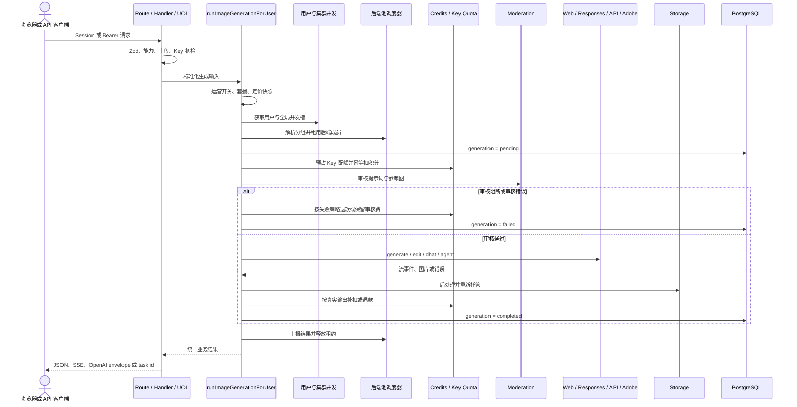

不可破坏的约束：

- 任何新图像入口必须委托这条管线，不能复制扣费、审核或存储逻辑。
- `generation.creditsConsumed` 只用于历史展示，不是财务审计真相。
- 所有并发渠道共享稳定 `generationId`，扣费幂等键仍唯一。
- 多渠道竞速只允许第一个成功结果写终态，失败渠道必须释放租约并停止迟到事件。
- relay-only 不落生成历史和用户内容，但仍执行审核、资源限制和计费。

### 9.2 后端池选择

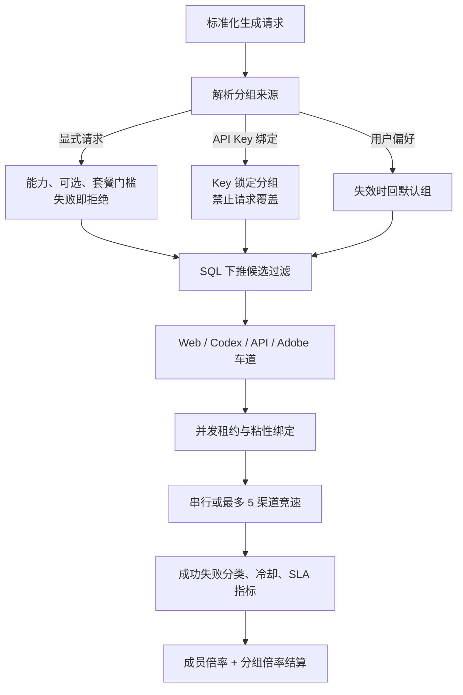

分组选择与计费绑定。用户显式选择无权或不可用时必须 fail-closed，不能静默切换到
倍率不同的默认组。`alwaysActive`、冷却、粘性、并发租约和错误分类是不同维度，改造时
不得合并成一个简单状态布尔值。

### 9.3 持久异步任务

图像、视频、PPT/PSD 的 async 入口已从进程内 Map 迁移到 PostgreSQL 持久协议。

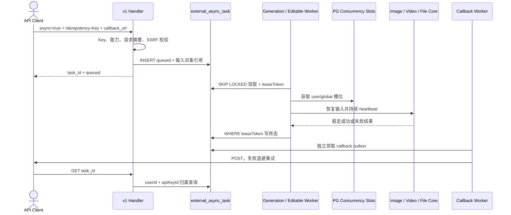

业务 I/O 在事务外执行；领取、心跳和终态更新使用短事务。旧 Worker 失去租约后不得继续
写终态、扣费或存储。普通生成的相同 Idempotency-Key 与相同内容重放返回 winner，内容
不同返回冲突。

### 9.4 支付、积分和返佣

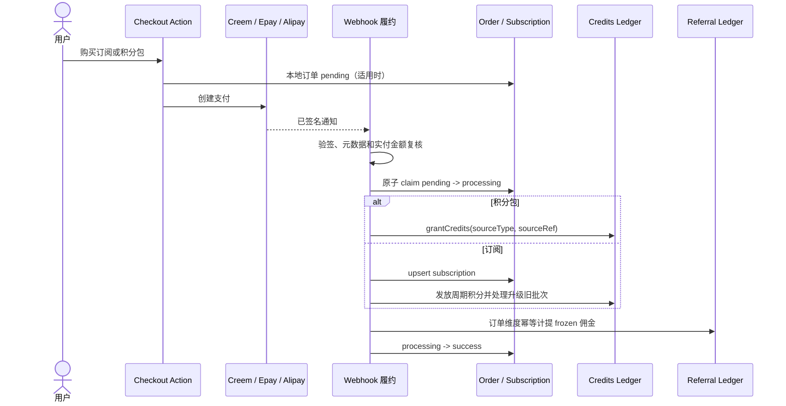

财务不变量：

- `credits_transaction` 是双重记账真相，`credits_balance` 是预计算缓存。
- 发放和退款使用 `credits_batch(source_type, source_ref)` 非空偏唯一索引。
- 消费使用 `credits_transaction(user_id, type, source_ref)` 非空偏唯一索引。
- 积分消费按批次 FIFO；底层 service 自带事务，UOL 不得再包外层事务。
- Webhook 不能简化为“收到通知就 grant”，必须保留验签、金额校验、claim 和重放语义。
- 拒付或退款需要同步处理订阅积分和返佣反向状态。

### 9.5 视频和可编辑文件

视频与 PPT/PSD 不属于图像管线的 mode，但复用套餐、后端池、并发、积分、存储和异步
基础设施：

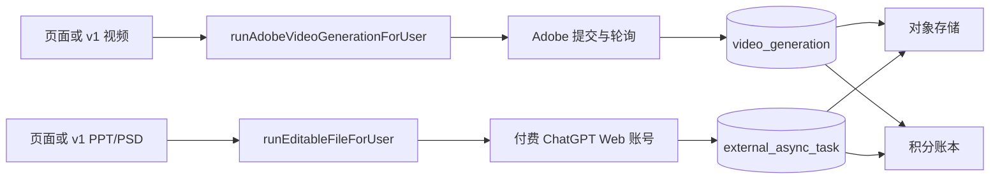

分层 PSD 导出是对现有生成产物的二次加工，不再次生图或扣费。当前部分导出仍使用
fire-and-forget，进程退出可能丢任务，后续应迁入 `external_async_task`。

## 10. 身份、权限与能力模型

### 10.1 身份类型

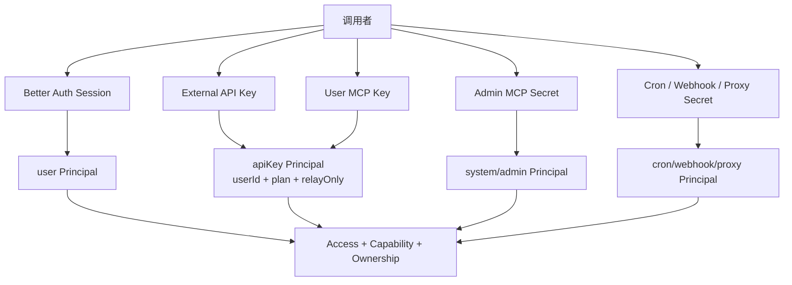

角色层级为 `user`、`observer_admin`、`admin`、`super_admin`。Server Action 梯度为
`actionClient`、`protectedAction`、`adminAction`、`superAdminAction` 和只读池观察者
Action。管理员操作必须每次从 DB 解析真实角色并复查封禁，不能信任前端导航状态。

原始 REST/MCP Key 不落库，只保存 SHA-256 hash、前缀和末四位。共享 secret 使用恒定
时间比较；REST Key 查询 hash 后还有二次 safe equal；用户 MCP Key 当前依赖固定长度
hash 的数据库等值查询，不应笼统描述为所有 Key 都做二次 timing-safe 比较。

### 10.2 套餐能力

套餐从低到高为 `free`、`starter`、`pro`、`ultra`、`enterprise`。能力唯一来源是
`packages/shared/src/subscription/services/plan-capabilities.ts`。

权限判断必须同时通过：

1. 运行时运营功能开关。
2. 当前套餐的 capability。
3. 数量、上传、并发、上下文等 limit。
4. 用户、API Key 和资源 ownership。
5. 后端分组、审核阈值等业务级约束。

只在 UI 隐藏功能不等于服务端关闭。新增能力位必须同步能力矩阵、系统设置示例和管理
面板，并由同步测试锁定。

## 11. UOL 统一操作层

### 11.1 当前调用模型

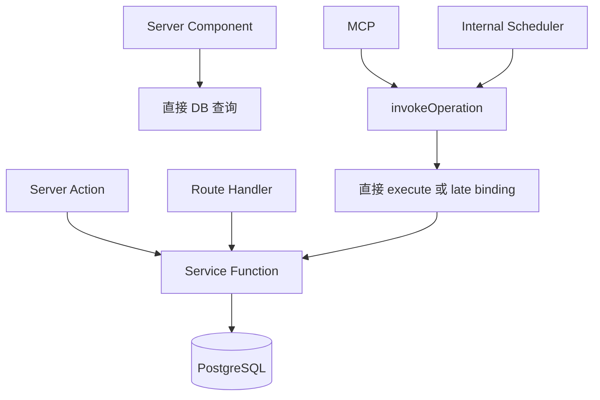

这张图反映当前混合状态。UOL 不是所有入口的唯一通道。

### 11.2 Operation 契约

每个 `defineOperation()` 声明：

- 稳定 name 和 domain。
- Zod input/output。
- `AccessRequirement`。
- 静态或动态 capability。
- `readOnly`、`destructive`。
- side effects。
- 幂等策略及 key field。
- 传输无关 `execute(input, principal, ctx)`。

`invokeOperation` 依次执行 Registry 查找、Access、输入校验、能力校验、幂等字段结构
检查、上下文构建、绑定检查、execute、输出校验和错误映射。

### 11.3 目标调用模型

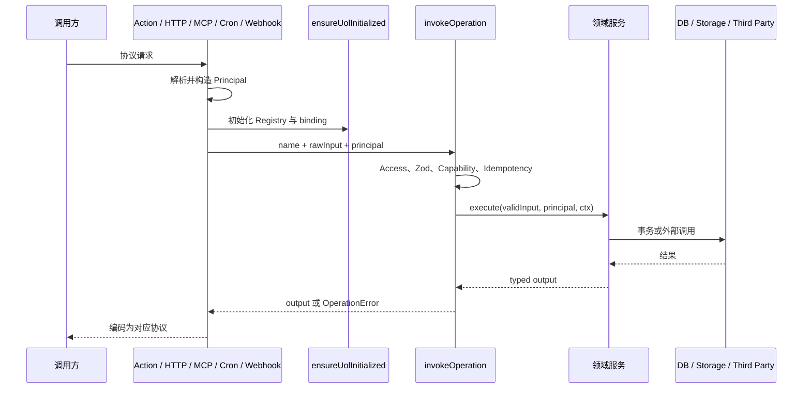

目标是让传输层只处理协议，不把 SSE、multipart 或 HTTP envelope 强行塞进领域层。
图像、视频、可编辑文件 Operation 的 execute 只委托既有单一核心，不能重写业务。

## 12. 数据、并发与事务架构

完整 44 表目录与 ER 图见[项目模型目录](PROJECT-MODEL-CATALOG.md)。这里保留跨域不变量：

- 数据库 Schema 真相在 `packages/database/src/schema.ts`。
- 迁移必须在 `packages/database/drizzle/` 手写幂等 SQL，并登记 journal。
- `drizzle-kit generate` 被脚本显式禁用。
- 标准 PG 和 Neon 都使用连接池。默认每进程 20 连接，多副本容量约为
  `副本数 * DB_POOL_MAX`，扩容要同步核算数据库连接上限。
- `internal_job_lease` 使用 `ownerId + runId` fencing 和 PostgreSQL `now()`。
- `image_generation_concurrency_slot` 以固定 user -> global 顺序原子领取槽位。
- `external_async_task` 的 worker lease 与 callback lease 分离。
- `generation` 和 `video_generation` 的 execution token 防止旧 Worker 覆盖终态。
- 后端成员并发由 inflight lease 管理，sticky binding 只提供短期亲和。

有意不建 FK 的逻辑引用包括被删除 API Key 的历史任务、调度多态 memberId、JSON 媒体
引用等。清理和归属必须由 service 层维护，不能把无 FK 等同于无关系。

## 13. 配置与缓存

### 13.1 配置优先级

启动时 `bootstrapSystemSettingsEnv` 会导入缺失 env、补默认值，再把 DB 中设置写回
`process.env`。所以运行时有效语义是：

```text
代码默认值 < 环境变量初始值 < system_setting 数据库值
```

数据库启动失败时会退回 env。管理后台的 secret 写入 DB，但读取界面不会回显明文。

### 13.2 缓存模型

- system settings：`unstable_cache`，TTL 60 秒，tag 失效，进程内 last-good 降级。
- session/role：React `cache()` 做单请求去重。
- 公告、支付聚合、SLA、画廊、状态页：Next cache + tag + TTL。
- storage provider：首次选择后进程缓存，切 local/S3 或轮换凭据需要重启。
- Redis：当前只用于限流，不承载业务真相。
- Upstash 未配置时使用每实例内存窗口，多副本会按副本数放大限流额度。

## 14. 存储与审核安全边界

### 14.1 存储

- 未配置 S3 endpoint 时使用本地 provider；生产多副本应使用 S3/R2/MinIO。
- 大文件先通过 UOL 获取套餐感知的直传授权，控制面只传对象引用。
- `storage.readObject` 校验 Principal、用户前缀、桶、用途和真实字节上限。
- generations 私有对象使用签名 URL；avatars 可公开。
- local provider 通过安全路径解析阻止目录穿越。
- 跨源图片抓取进行 DNS pin、私网地址拒绝、重定向逐跳校验，并剥离客户端
  Authorization/Cookie。

### 14.2 审核

审核支持 Aliyun、OpenAI 或审核代理。默认失败关闭：provider error 返回 error，图像
管线将其视为阻断而不是放行。风险阈值由套餐上限、用户设置和 API Key 设置共同归一。

`relay-only` 也必须审核，但不能持久化 prompt、参考图或生成产物。改日志、异步任务和
可观测性时需专项检查这一隐私边界。

## 15. 后台任务与可观测性

### 15.1 内置任务

内置任务包括图片维护、积分过期、返佣解冻、Web 账号刷新/补充、Sub2API 同步和异步
任务保留清理。调度模型是：

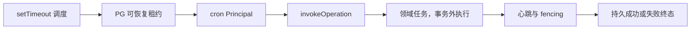

### 15.2 可观测性

- Pino：开发 console，生产 stdout + 异步滚动文件，敏感字段深度脱敏。
- Sentry：可选 DSN，服务端/客户端错误、trace、source map。
- Prometheus：受独立 Token 保护，只输出固定低基数任务和队列聚合。
- Health：liveness 不访问依赖，readiness 以 2 秒 DB 查询判断。
- Web Vitals/Lighthouse：覆盖公开页和登录态页面，CI 有资源体积预算。
- Axiom 依赖和配置项存在，但当前 logger 没有接入 Axiom transport，不能把它写成已落地。

## 16. 部署与发布

### 16.1 Docker Compose 当前拓扑

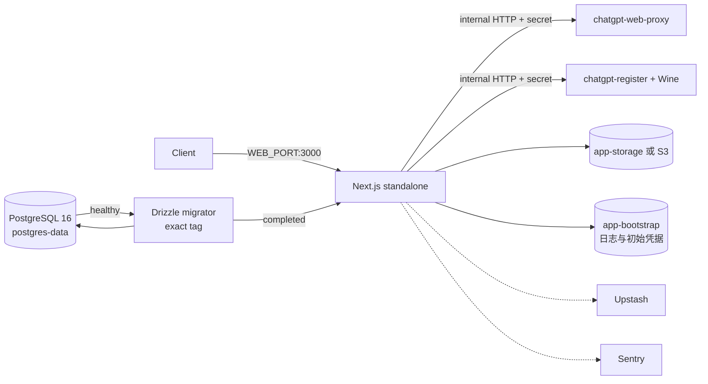

Web 镜像采用 Node 22 slim 和多阶段 `turbo prune -> frozen install -> next standalone`，
显式追踪 Sharp、ONNX 原生库和模型，runner 最终降权到 uid/gid 1001。

Compose 强制 exact release tag，先等待 PG 健康，再运行迁移，成功后启动 Web。当前
Compose 未把已有 live/ready 路由接成 Web healthcheck，Sidecar 也缺 healthcheck 和资源
限制，这是运维改进项。

环境专用蓝绿方案见 [deploy-nginx-ab.md](deploy-nginx-ab.md)。数据库迁移不可随代码
回滚，所有生产迁移应遵守 expand -> backfill/dual-read -> switch -> contract。

### 16.2 CI/CD

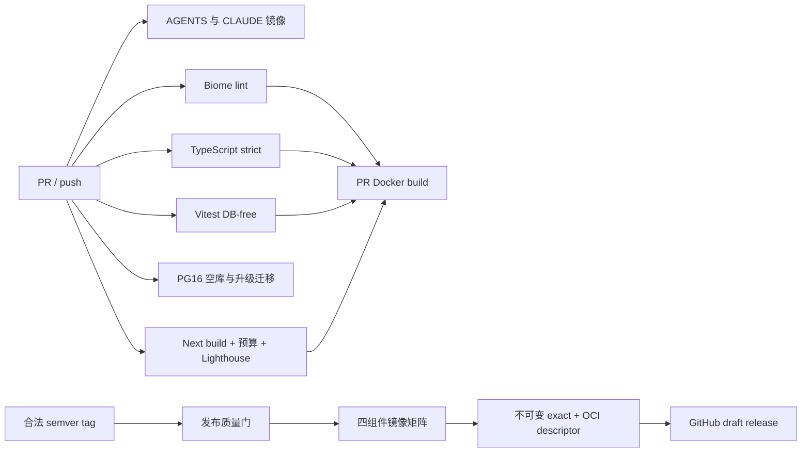

发布四组件为 web、migrator、proxy、register。tag 发布时前三者支持 amd64/arm64，Wine
注册机仅 amd64。所有组件成功后才移动 release descriptor channel，避免消费者看到半套
版本。

当前风险是 release workflow 自身没有复跑真实 PG migration job；它依赖相同提交的普通
CI 已执行。更稳妥的目标是让 promote 显式依赖迁移门禁结果。

## 17. 关键风险与交接红线

| 风险 | 影响 | 交接要求 |
| --- | --- | --- |
| 巨型核心文件 | 修改易跨计费、调度、存储 | 按职责渐进抽取，不建第二管线 |
| UOL 未完全接线 | Operation 可能返回 501 | 先查 `isOperationBound`，逐域对拍 |
| 页面和 Action 直连 DB | 权限和错误语义分散 | 新改造先补 Operation，再收薄传输层 |
| 进程内缓存/限流 | 多副本短时不一致 | 多副本强制 Upstash、S3，设置变更滚动重启 |
| 常驻 Worker | Serverless 会丢后台执行 | 独立部署 Worker/Scheduler |
| 明文业务凭据落库 | DB/备份泄露面大 | 引入 envelope encryption 与轮换 |
| Better Auth 关闭通用 CSRF 检查 | 跨站状态变更风险 | 保留威胁模型，补 Origin/SameSite 回归 |
| 用户删除级联财务账 | 合规审计链丢失 | 评估匿名化主体、账本保留 |
| DB 金额约束不足 | 绕过应用可制造坏账 | 渐进加 CHECK 和对账任务 |
| relay-only | 隐私承诺易被日志/任务破坏 | 对持久化与日志做专项测试 |
| 本地存储 | 多副本与容器重建丢一致性 | 生产使用对象存储 |
| 双 v1 前缀 | 修改可能只覆盖一边 | 共享 handler 和契约测试 |
| 原生依赖 | standalone trace/镜像兼容 | 保留 slim glibc 和原生冒烟 |
| 缺浏览器 E2E | 登录、SSE、支付、后台回归不足 | 增加 Playwright 关键路径 |

## 18. 改动前必查清单

### 图像、视频、文件生成

- 是否仍委托三个单一核心之一？
- 是否同时保持 Session、v1、MCP 的能力和错误语义？
- generation/task id 是否稳定，扣费 sourceRef 是否可重放？
- 失去 execution token 后是否停止副作用？
- relay-only 是否仍不持久化用户内容？

### 财务与支付

- 是否以 credits ledger 而不是 generation 行为真相？
- 发放、消费、退款、Webhook 是否有稳定幂等键？
- 并发重复请求和金额漂移是否被拒绝？
- 底层已有事务时是否避免外层嵌套？
- 退款/拒付是否反向处理订阅批次和返佣？

### 权限与安全

- 是否从 Principal 派生 userId，而不是信任输入 userId？
- 是否校验 ownership，跨用户资源是否统一隐藏为 not found？
- 是否同时校验运营开关、capability、limit 和分组规则？
- 是否验证所有外部输入和第三方响应大小？
- 是否避免把客户端 Authorization/Cookie 转发到第三方？

### 数据库与部署

- 迁移是否为手写幂等 SQL并登记 journal？
- 是否按 expand/contract 兼容旧版本？
- 新 Worker/任务是否使用短事务、租约、心跳和 fencing？
- 多副本下是否仍以 PostgreSQL/S3/Redis 为共享状态？
- 是否补空库、升级、重复迁移和真实并发测试？

## 19. 关键事实源

- [AGENTS.md](../AGENTS.md)：最高优先级协作与架构约束。
- [package.json](../package.json)、[turbo.json](../turbo.json)：工程任务和版本。
- [apps/web/src/app](../apps/web/src/app)：页面与传输入口。
- [apps/web/src/features](../apps/web/src/features)：应用服务和业务 UI。
- [packages/shared/src/uol](../packages/shared/src/uol)：统一操作层。
- [packages/database/src/schema.ts](../packages/database/src/schema.ts)：数据模型真相。
- [packages/database/drizzle](../packages/database/drizzle)：迁移真相。
- [image-backend-pool-scheduling.md](image-backend-pool-scheduling.md)：调度语义。
- [Agent 集成架构](plan/2026-05-31-agent-integration-architecture.md)：UOL 目标设计。
- [系统工程与性能审计](plan/2026-07-10-system-performance-audit.md)：最新并发与运行时事实。
- [CI-CD.md](CI-CD.md)、[ci.yml](../.github/workflows/ci.yml)、
  [docker-release.yml](../.github/workflows/docker-release.yml)：质量与发布事实。

改造落地顺序、验收矩阵和拆分建议见
[交接改造技术方案](plan/2026-07-10-project-handover-refactor.md)。
