# GPT2Image-Pro 项目模型目录

> 职责：集中说明项目中的领域模型、数据库模型、状态机、AI 模型、套餐能力模型和
> 定价模型，避免交接时把“模型”仅理解为上游 AI model id。
> 快照日期：2026-07-10。
> 数据库事实源：`packages/database/src/schema.ts` 与
> `packages/database/drizzle/`。

## 1. 模型分层

本项目中的“模型”至少有六种：

1. **领域模型**：用户、套餐、积分、生成、后端池、订单、返佣、工单。
2. **持久化模型**：44 张 PostgreSQL 表和 11 个枚举。
3. **接口模型**：UOL Operation、Principal、AccessRequirement、OperationError。
4. **运行状态模型**：生成、视频、异步任务、回调、租约、积分批次状态机。
5. **AI 模型目录**：图像、Chat/Responses、Adobe 图像/视频、本地 ONNX。
6. **商业模型**：套餐能力矩阵、计价规则、后端/分组倍率、API Key 配额。

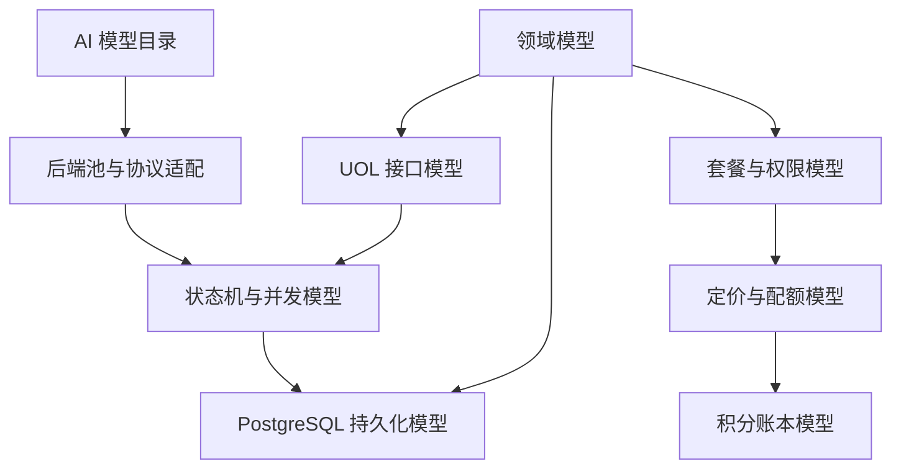

## 2. 领域边界

| 领域 | 聚合根或核心服务 | 主要持久化模型 |
| --- | --- | --- |
| Identity | user、Better Auth、Principal | user/session/account/verification |
| Subscription | plan capability、subscription | subscription/system_setting |
| Billing | credits ledger、payment fulfillment | balance/batch/transaction/order |
| Generation | image/video/file core | generation/video/async task |
| Backend Pool | group、member、scheduler | group/account/api/adobe/lease |
| Storage | StorageProvider | 对象存储；DB 保存 bucket/key |
| Moderation | ModerateContent | 运行时决策，不单独留存内容 |
| Referral | profile/binding/commission/transfer | 四张 referral 表 |
| Support | ticket/announcement | ticket/message/announcement/read |
| Operations | settings/job/audit/metrics | setting/job lease/admin audit |

## 3. 数据库总览

### 3.1 物理关系总图

实线代表数据库 FK；虚线代表有意由服务层维护的逻辑引用。

```mermaid
erDiagram
  USER ||--o{ SESSION : owns
  USER ||--o{ ACCOUNT : owns
  USER ||--o| REGISTRATION_IDENTITY : first_registered
  USER ||--o| SUBSCRIPTION : subscribes
  USER ||--o| CREDITS_BALANCE : caches
  USER ||--o{ CREDITS_BATCH : receives
  USER ||--o{ CREDITS_TRANSACTION : ledger
  USER ||--o{ EXTERNAL_API_KEY : owns
  EXTERNAL_API_KEY ||--o{ EXTERNAL_API_KEY_USAGE : quota_ledger
  USER ||--o{ MCP_API_KEY : owns
  USER ||--o{ GENERATION : creates
  USER ||--o{ VIDEO_GENERATION : creates
  USER ||--o{ EXTERNAL_ASYNC_TASK : submits
  EXTERNAL_API_KEY |o..o{ EXTERNAL_ASYNC_TASK : audit_reference
  USER ||--o| REFERRAL_PROFILE : has
  USER ||--o{ REFERRAL_BINDING : participates
  USER ||--o{ REFERRAL_COMMISSION_LEDGER : participates
  USER ||--o{ REFERRAL_TRANSFER : converts
  REFERRAL_TRANSFER }o..o{ CREDITS_BATCH : logical_result
  USER ||--o{ TICKET : opens
  TICKET ||--o{ TICKET_MESSAGE : contains
  USER ||--o{ ANNOUNCEMENT_READ : reads
  ANNOUNCEMENT ||--o{ ANNOUNCEMENT_READ : receipt
```

### 3.2 后端池关系图

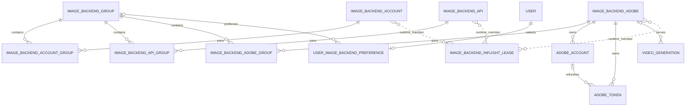

调度表使用 `memberType + memberId` 表达多态成员，因此不建物理 FK。删除后端成员时需要
service 层清理或等待租约、粘性绑定自然过期。

## 4. 44 张表数据字典

### 4.1 身份、认证与审计

| 表 | 职责 | 关键字段与约束 | 删除/安全语义 |
| --- | --- | --- | --- |
| `user` | 主用户身份 | email 唯一；role；banned；审核阈值；customerId 唯一 | 聚合根；多数私有数据级联 |
| `session` | Better Auth 会话 | token 唯一；expiresAt；userId FK | 用户删除级联 |
| `account` | 密码/OAuth 账户 | providerId、accountId、token、password hash | 用户删除级联；含高敏令牌 |
| `verification` | 邮箱验证/重置令牌 | identifier、value、expiresAt | 消费型短期数据 |
| `registration_identity` | 永久注册邮箱账本 | email 唯一；首次/最近/删除时间 | 用户删除后 userId 置空，防重复领奖 |
| `admin_audit_log` | 高风险管理审计 | actor/target、action、before/after、metadata | 用户删除时 SET NULL，保留审计 |
| `mcp_api_key` | 用户 MCP Key | keyHash 唯一；prefix；lastFour；revokedAt | 原始 Key 仅创建时返回 |

### 4.2 订阅、支付与积分

| 表 | 职责 | 关键字段与约束 | 真相与幂等 |
| --- | --- | --- | --- |
| `subscription` | 当前用户订阅 | userId 唯一；subscriptionId 唯一；周期与取消状态 | 用户 1:1，统一 upsert |
| `epay_order` | Epay 本地订单 | outTradeNo 主键；amount numeric(12,2)；status | Webhook 原子 claim 的本地锚点 |
| `credits_balance` | 余额快照 | userId 唯一；balance/earned/spent；status | 读性能缓存，不是财务真相 |
| `credits_batch` | 可消费积分库存 | amount、remaining、expiresAt、sourceType/ref | 发放/退款以 sourceType+sourceRef 幂等 |
| `credits_transaction` | 双重记账流水 | amount、debitAccount、creditAccount、type、sourceRef | **财务真相**；消费按 user+type+sourceRef 幂等 |

积分模型不是单表余额模型：每次发放创建 batch 和 transaction，同时更新 balance；消费按
批次 FIFO 减少 remaining，创建 transaction，再更新 balance。任何对账都应从
transaction/batch 推导并校验 balance。

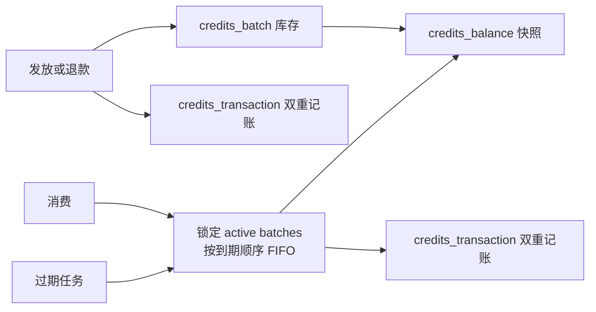

### 4.3 返佣

| 表 | 职责 | 关键字段与约束 | 状态语义 |
| --- | --- | --- | --- |
| `referral_profile` | 邀请人档案 | userId 主键；referralCode 唯一；专属费率 | 每用户一份 |
| `referral_binding` | 一次性邀请归因 | inviteeUserId 唯一；inviter/invitee FK | 不允许事后改绑 |
| `referral_commission_ledger` | 订单返佣权益 | provider+orderId+inviter 唯一 | frozen -> available -> converting -> converted/canceled |
| `referral_transfer` | 返佣转积分记录 | sourceRef 唯一；commissionIds；结果 batch/tx id | pending -> completed/failed |

`referral_transfer.creditsBatchId` 和 `creditsTransactionId` 是逻辑结果引用，不建 FK，防止
财务模块与返佣模块形成强删除耦合。

### 4.4 生成、异步任务与配额

| 表 | 职责 | 关键字段与约束 | 真相与并发 |
| --- | --- | --- | --- |
| `generation` | 图像产物/历史 | prompt/model/size/status/storageKey/metadata | 图像产物真相；executionToken 防旧 Worker |
| `video_generation` | 视频独立状态机 | family/duration/ratio/resolution/pollUrl/storageKey | 视频产物真相；财务仍在 credits ledger |
| `external_async_task` | 持久任务壳和 callback outbox | taskType、leaseToken、callbackLeaseToken、requestHash | Worker 与 callback 各自租约和 fencing |
| `external_api_key` | v1 API Key | keyHash、quota、relayOnly、group、审核阈值 | 原始 key 不落库；用户删除级联 |
| `external_api_key_usage` | Key 配额预占/退款账 | apiKeyId+sourceRef 唯一；amount>0；reserved/refunded | 防重复预占与多退 |
| `chat_no_image_state` | Chat 连续无图惩罚状态 | userId 主键；计数、惩罚截止、lastGenerationId | 用户级运行状态 |
| `image_generation_concurrency_slot` | 集群生图 semaphore | scope+scopeKey+slotNo 复合主键 | leaseId、heartbeat、TTL |

#### generation 状态机

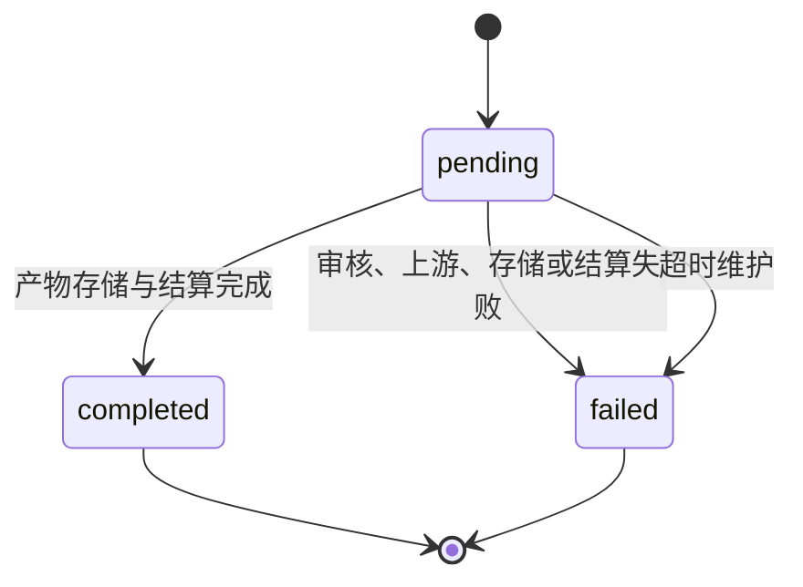

#### video_generation 状态机

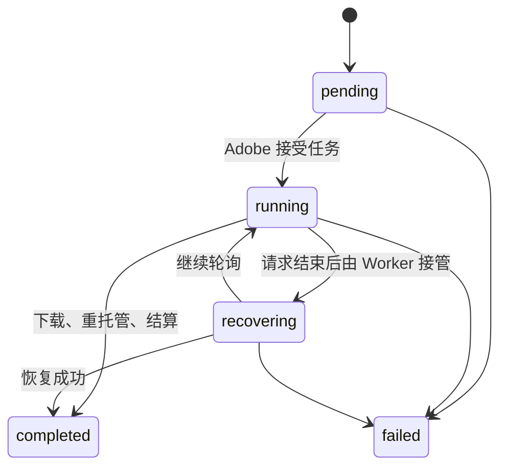

#### external_async_task 状态机

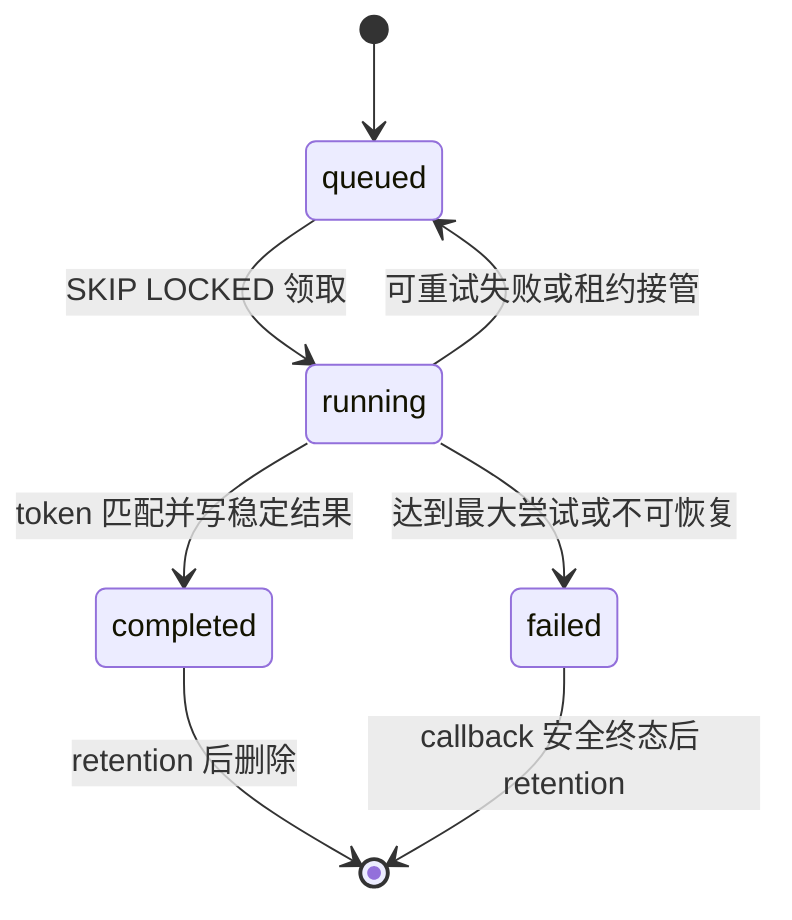

#### callback outbox 状态机

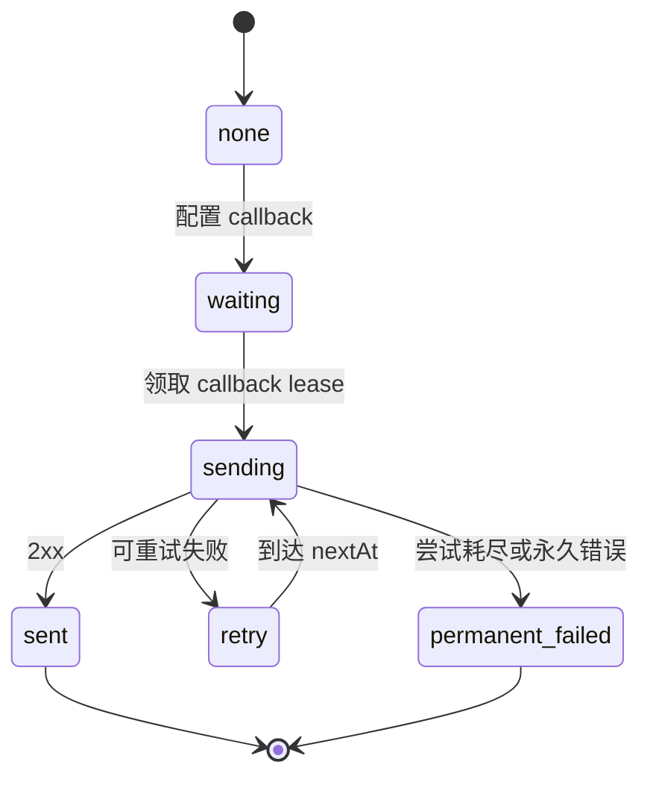

### 4.5 后端池

| 表 | 职责 | 关键字段与约束 | 说明 |
| --- | --- | --- | --- |
| `image_backend_group` | 业务分组 | enabled/default/selectable/safety/priority/metadata | metadata 含 minPlan 等扩展 |
| `image_backend_account` | Web/Codex 账号 | credential hash 唯一；plan/type/status/concurrency | access/refresh token 高敏 |
| `image_backend_account_group` | 账号与组 M:N | accountId+groupId 唯一 | groupId 主分组字段仍兼容保留 |
| `image_backend_api` | OpenAI/Google 协议后端 | baseUrl/apiKey/protocol/models/concurrency/cooldown | apiKey 高敏；支持倍率 |
| `image_backend_api_group` | API 与组 M:N | apiId+groupId 唯一 | 多组复用同一 API |
| `image_backend_adobe` | Firefly gateway/direct 后端 | mode/baseUrl/apiKey/models/concurrency/multiplier | 图像和视频特殊协议 |
| `image_backend_adobe_group` | Adobe 与组 M:N | adobeId+groupId 唯一 | 多组复用 |
| `adobe_account` | Adobe 账号刷新档案 | adobeId FK；cookie；身份与状态 | 长期 cookie 高敏 |
| `adobe_token` | Adobe IMS 短期 Token | adobeId/accountId；token/status/quota | token 高敏、可轮换 |
| `image_backend_inflight_lease` | 成员并发占用 | memberType/memberId/expiresAt | 多态逻辑引用，无 FK |
| `image_backend_sticky_binding` | 会话/任务短期亲和 | scope+bindingKey 唯一；member type/id | TTL 后失效 |
| `image_backend_scheduler_metric` | 调度时间桶指标 | bucket+group+member+metric 唯一 | 低基数聚合 |
| `user_image_backend_preference` | 用户默认分组 | userId 唯一；groupId 可空 | 失效时回默认组 |
| `user_api_config` | 用户自定义外接上游 | userId 唯一；baseUrl/apiKey/model | capability 与 SSRF 共同门控 |

后端成员共有的概念模型：

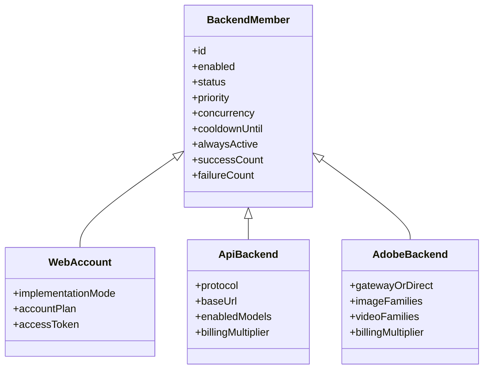

### 4.6 配置、运营与支持

| 表 | 职责 | 关键字段与约束 | 说明 |
| --- | --- | --- | --- |
| `system_setting` | 运行时配置中心 | key 主键；JSON value；isSecret；updatedBy | DB 值运行时覆盖 env |
| `internal_job_lease` | 内置任务跨副本租约 | jobName 主键；ownerId+runId；heartbeat/terminal | PG 时钟、可恢复接管 |
| `announcement` | 公告 | 发布、置顶、有效期、创建/更新管理员 | active 由时间和发布态共同决定 |
| `announcement_read` | 用户公告已读 | userId+announcementId 唯一 | upsert 幂等 |
| `ticket` | 工单 | category/priority/status、双方 lastSeen | 用户归属 |
| `ticket_message` | 工单消息 | ticketId/userId/content/isAdmin | 工单删除级联 |
| `newsletter_subscriber` | 邮件订阅 | email 唯一；isActive；unsubscribeAt | 软退订 |

## 5. 11 个 PostgreSQL 枚举

| 枚举 | 值 | 用途 |
| --- | --- | --- |
| `user_role` | user、observer_admin、admin、super_admin | 用户与管理角色 |
| `credits_balance_status` | active、frozen | 积分账户状态 |
| `credits_batch_status` | active、consumed、expired | 批次库存状态 |
| `credits_batch_source` | purchase、subscription、bonus、refund、referral | 批次来源 |
| `credits_transaction_type` | purchase、consumption、monthly_grant、registration_bonus、admin_grant、expiration、refund、referral_bonus | 账本类型 |
| `referral_commission_status` | frozen、available、converting、converted、canceled | 返佣权益状态 |
| `referral_transfer_status` | pending、completed、failed | 转积分状态 |
| `ticket_category` | billing、technical、bug、feature、other | 工单分类 |
| `ticket_priority` | low、medium、high | 工单优先级 |
| `ticket_status` | open、in_progress、resolved、closed | 工单状态 |
| `generation_status` | pending、completed、failed | 图像生成状态 |

视频、异步任务、callback 等状态当前使用 text + TypeScript union + DB CHECK，而不是
PostgreSQL enum。新增状态必须同时更新 TypeScript、Schema CHECK、迁移、Worker 和响应映射。

## 6. 有意不建 FK 的逻辑关系

| 字段 | 逻辑目标 | 不建 FK 原因 | 维护责任 |
| --- | --- | --- | --- |
| `external_async_task.api_key_id` | external_api_key | Key 删除后任务/outbox 仍需保留 | 任务查询与 retention service |
| `video_generation.api_key_id` | external_api_key | 保留历史审计 ID | 视频 service |
| `chat_no_image_state.last_generation_id` | generation | 软状态引用 | Chat service |
| `referral_transfer.credits_*_id` | credits batch/tx | 避免跨账本强删除耦合 | referral/credits service |
| 调度表 `member_id` | account/api/adobe | 多态成员 | backend pool service |
| `video_generation.input_image_refs` | generation/storage | 多来源 JSON 引用 | video input cleanup |

这些字段在 ER 图中应画虚线。不要为了“补完整关系”直接加级联 FK；先验证历史保留、
删除和多态语义。

## 7. UOL 接口模型

### 7.1 OperationDefinition

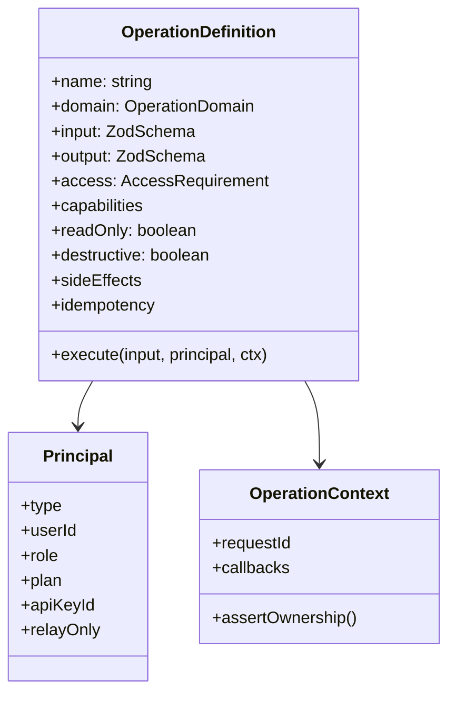

Principal 有 user、apiKey、system、cron、webhook、proxy 等变体。所有计费用户 ID 应从
Principal 派生，禁止接受输入中的 userId 覆盖已认证身份。

### 7.2 当前 UOL 边界缺口

- 172 个 Operation 中仍有 77 个未接线，调用会得到 not implemented。
- `assertCapabilities` 当前只对 apiKey Principal 统一校验；user Principal 仍依赖旧
  Server Action/route 门禁。会话入口 UOL 化前必须给 user Principal 注入 plan，或由
  网关解析套餐并补 user/apiKey/system 对拍测试。
- `image.generate` 的 `generationId` 输入 schema 可选，但幂等策略要求该字段必填。
  Transport 必须生成稳定 ID，不能依赖核心事后随机生成。

## 8. AI 模型目录

### 8.1 图像模型

| 模型/族 | 路由语义 | 说明 |
| --- | --- | --- |
| `gpt-image-2` | 默认图像模型 | 文生图、编辑等默认标识 |
| `gpt-image-1` | legacy alias | 归一后回到默认模型 |
| `gpt-image-*` | 图像族 | 可由 Web/Codex/API 后端处理 |
| `firefly-gpt-image-2` | Adobe 图像族 | 1K/2K/4K，多比例 |
| `firefly-gpt-image-1.5` | Adobe 图像族 | 1K/2K/4K，多比例 |
| `firefly-nano-banana-pro` | Adobe 图像族 | Nano Banana 2 上游版本 |
| `firefly-nano-banana` | Adobe 图像族 | Nano Banana 2 上游版本 |
| `firefly-nano-banana2` | Adobe 图像族 | Nano Banana 3，额外超宽比例 |

外部 `/v1/models` 暴露的是 5 个 Firefly 图像族级 ID，size 再决定分辨率和比例；内部
目录展开为 117 个完整组合，避免外部列表膨胀。

图像尺寸约束：256 至 3840、16 像素步进、最大比例 3:1、最大像素 3840x2160。
默认尺寸为 1024x1024，模型质量和 thinking 当前只作为上游参数，不再改变基础积分倍率。

### 8.2 Chat/Responses 模型

| model id | 默认开放规则 | 主要用途 |
| --- | --- | --- |
| `gpt-5.4` | 能力允许时 | Chat/Responses |
| `gpt-5.4-mini` | 能力允许时 | Chat/Responses |
| `gpt-5.2` | 能力允许时 | Chat/Responses |
| `gpt-5.3-codex` | 能力允许时 | Codex/Responses 图像工作流 |
| `gpt-5.3-codex-spark` | 能力允许时 | Codex Spark 工作流 |
| `gpt-5.5` | 默认 Ultra 及以上 | 高级 Chat/Responses |

模型是否出现在 `/v1/models` 还受 external API capability 控制，不等同于代码常量存在就
允许调用。

### 8.3 Adobe 视频模型

| 族 | 时长 | 比例 | 分辨率 | 特性 |
| --- | --- | --- | --- | --- |
| Sora 2 | 4/8/12 秒 | 16:9、9:16 | 720p | 标准 |
| Sora 2 Pro | 4/8/12 秒 | 16:9、9:16 | 720p | Pro 族 |
| Veo 3.1 | 4/6/8 秒 | 16:9、9:16 | 720p/1080p | 标准引擎 |
| Veo 3.1 Reference | 4/6/8 秒 | 16:9、9:16 | 720p/1080p | reference image |
| Veo 3.1 Fast | 4/6/8 秒 | 16:9、9:16 | 720p/1080p | fast 引擎 |
| Kling O3 | 5/15 秒 | 16:9、9:16 | 1080p | reference-to-video |
| Kling 3.0 | 5/10/15 秒 | 16:9、9:16 | 720p | 默认生成音频 |

完整视频 model id 编码族、时长、比例，Veo 系列额外编码分辨率。目录共 58 个完整 ID。
视频基础价为每秒积分，再叠加模型族倍率和后端倍率。

### 8.4 本地 ONNX 模型

| 模型 | 文件/路径 | 用途 | 运行边界 |
| --- | --- | --- | --- |
| Real-ESRGAN general-x4v3 | `models/realesr-general-x4v3.onnx` | 4 倍超分和分辨率校准 | 分块推理，Session 进程缓存 |
| SCUNet color real-GAN | `models/scunet-color-real-gan.onnx` | 1x 盲复原，不改变尺寸 | CPU 重，进程内全局串行 |
| ISNet | `models/isnet.onnx` | 抠图与 PSD 透明层 | 1024 输入，Session 进程缓存 |

模型路径可由环境变量覆盖。Docker standalone 必须显式包含 ONNX Runtime 原生库和模型
文件；生产镜像采用 glibc slim，不应随意换 Alpine。

## 9. 套餐与能力模型

套餐层级：

能力矩阵由 feature 最低套餐、每套餐 limit、审核阈值和计费配置组成。默认重点如下：

| 能力 | 默认最低套餐 |
| --- | --- |
| 文生图、图生图、批量、PPT、PSD | free |
| Chat、Agent、Waterfall、提示词控制 | pro |
| GPT-5.5 | ultra |
| 外部 Key 管理、models、chat、images | starter |
| 外部 Responses、relay-only | pro |
| 外部 Agent | ultra |

Limit 包括文件大小、单次上传、队列优先级、生图并发、月积分、批量数量、编辑/Chat 图片
数和上下文字符数。归一化逻辑保证高套餐 limit 不低于低套餐。

## 10. 定价与配额模型

最终费用不是单一常量：

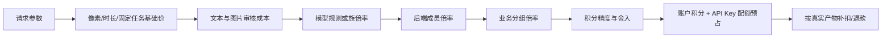

图像基础价按像素在 1024 基准与 4K 基准间插值，叠加审核成本；视频按秒；PPT/PSD
按任务固定价。`packages/shared/src/model-pricing/` 支持 model/family/modality/backend group
scope，以及倍率、per-call、token 或 mixed 规则。财务单位始终是 credits。

外部 API 同时受两本账约束：用户积分账本和 Key 独立额度账。两者必须使用同一稳定
sourceRef 预占与退款，不能只回滚其中一本账。

## 11. 敏感数据与保留模型

| 数据 | 当前存储 | 主要风险 | 建议目标 |
| --- | --- | --- | --- |
| 用户密码 | account.password hash | hash 策略升级 | 保持 Better Auth 标准 |
| Session token | session.token | DB 泄露 | 短 TTL、会话撤销、备份加密 |
| 外部/MCP Key | SHA-256 hash | 离线枚举低概率 | 高熵 Key、吊销、lastFour 展示 |
| 上游 API Key | system_setting/backend 表明文 | DB/备份泄露 | KMS envelope encryption |
| Web/Adobe Cookie/Token | backend/adobe 表明文 | 可直接接管账号 | 优先加密、轮换和访问审计 |
| 生成 prompt/metadata | generation/async task | 隐私与保留周期 | retention、relay-only 不落库 |
| 财务账本 | 用户删除级联 | 审计链丢失 | 匿名化主体后保留账本 |
| 管理审计 | admin_audit_log | actor 删除 | SET NULL 保留快照 |

## 12. 数据改造准则

1. Schema 拆文件可以做，但必须由 `schema.ts` 统一再导出，保持公共接口。
2. 迁移只写幂等 SQL，不使用 `drizzle-kit generate`。
3. 新约束采用 `NOT VALID -> 数据清洗 -> VALIDATE` 或兼容等价方案，避免长时间锁表。
4. 金额和积分优先补 `CHECK`、唯一索引和真实 PG 并发测试，不只依赖 TypeScript。
5. 业务状态新增值要同步 Schema、迁移、TypeScript、Worker、API 映射和监控。
6. 有意无 FK 的逻辑引用要在 service 层有清理和 ownership 测试。
7. 删除账户前先解决财务、审计和隐私保留策略，不能只依赖级联方便。

整体架构与改造顺序见[项目架构与交接手册](PROJECT-ARCHITECTURE-HANDBOOK.md)和
[交接改造技术方案](plan/2026-07-10-project-handover-refactor.md)。
