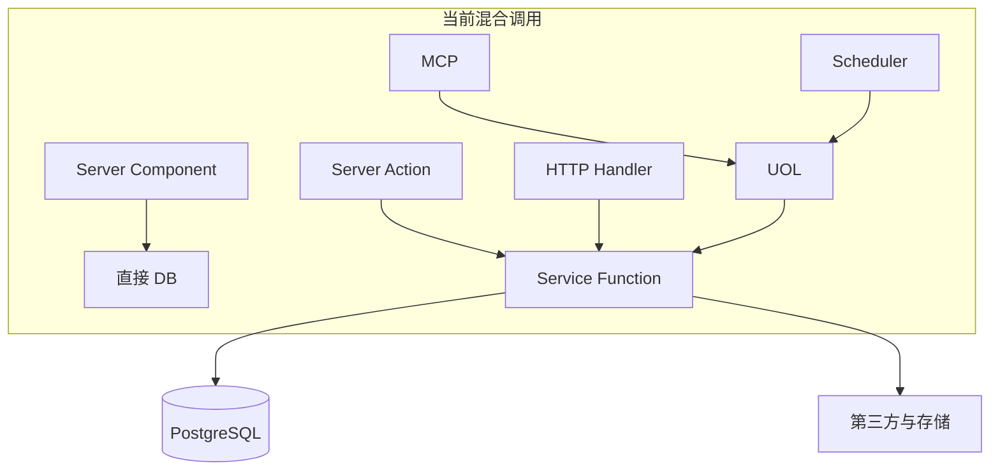
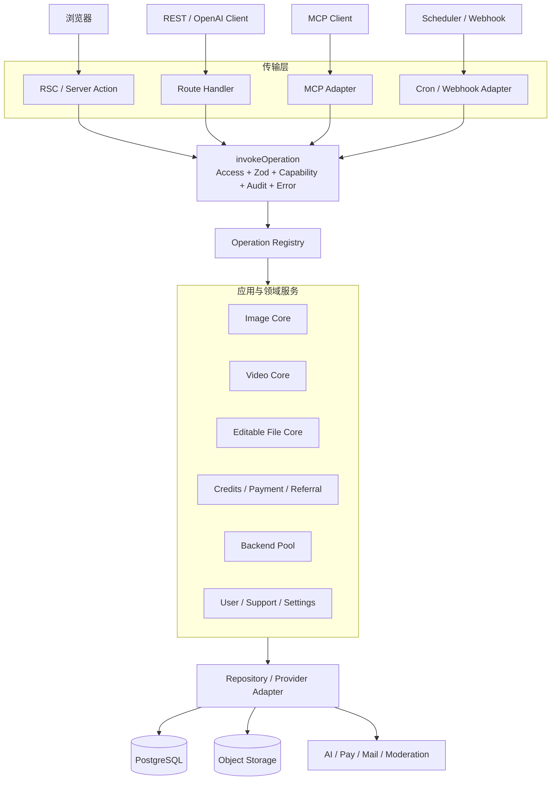
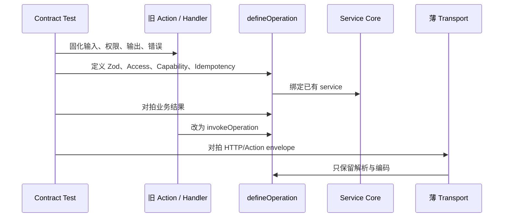
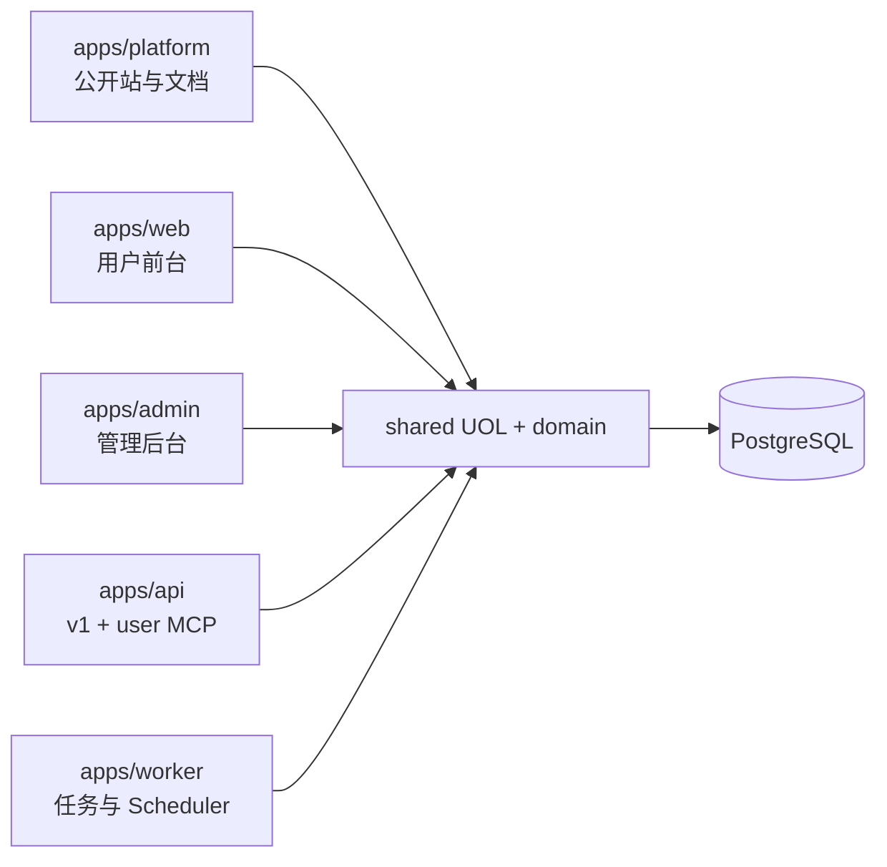

# GPT2Image-Pro 交接改造技术方案

> 状态：建议方案，尚未整体实施。
> 日期：2026-07-10。
> 现状总览：[项目架构与交接手册](../PROJECT-ARCHITECTURE-HANDBOOK.md)。
> 模型目录：[项目模型目录](../PROJECT-MODEL-CATALOG.md)。
> 上位约束：[Agent 集成架构](2026-05-31-agent-integration-architecture.md)。

## 1. 改造目标

本方案不追求一次性重写，而是把当前模块化单体渐进收敛为：

- 一个可复用、可审计、传输无关的 UOL 操作层。
- 三个不可复制的生成核心：图像、视频、可编辑文件。
- PostgreSQL 中明确的财务、任务、并发和审计真相。
- 可以从单体平滑演进到多进程或多应用的部署边界。
- 每一步都能对拍旧行为、独立回滚代码，并保持数据向前兼容。

### 1.1 非目标

- 不重写成熟的积分、调度、审核和存储内核。
- 不为了目录整齐机械拆大文件。
- 不在 UOL 外再建一套 GraphQL/RPC 业务真相。
- 不把 HTTP、SSE、multipart、MCP envelope 放进领域 service。
- 不在 UOL 网关外层包裹已有底层事务。
- 不先做多应用拆分，再回头修接口边界。

## 2. 当前问题模型



主要后果：

1. 权限、capability、ownership 和错误映射在不同入口重复。
2. 同一功能通过页面、v1、MCP 调用时可能产生行为漂移。
3. UOL 已注册但未绑定的 Operation 会返回 501。
4. `apps/web` 与 `packages/shared` 都直接操作 DB，难以独立部署或复用。
5. 核心文件过大，策略、编排、I/O 和持久化修改容易互相影响。
6. DB-free 单测强，但浏览器 E2E 和真实业务 PG 并发测试不足。

## 3. 目标架构



### 3.1 层级职责

| 层 | 允许做什么 | 禁止做什么 |
| --- | --- | --- |
| Transport | 解析协议、构造 Principal、编码响应、SSE/multipart | 业务授权、扣费、直接 DB mutation |
| UOL Gateway | Access、Zod、capability、ownership、审计、幂等声明、错误 | 上游协议细节、长事务 |
| Operation execute | 委托领域服务、映射 typed output | 复制生成/支付内核 |
| Domain/Application | 业务编排、状态机、补偿、事务入口 | 依赖 Next Request/Response |
| Repository/Provider | DB、存储、第三方 I/O | 决定用户权限或产品能力 |

## 4. 必须冻结的契约

在任何结构改造前，先用测试锁定以下契约：

### 4.1 生成契约

- 图像统一走 `runImageGenerationForUser`。
- 视频统一走 `runAdobeVideoGenerationForUser`。
- PPT/PSD 统一走 `runEditableFileForUser`。
- 同一请求的 generation/task id、sourceRef、Key quota sourceRef 稳定。
- relay-only 不落 prompt、输入图、generation 历史和产物。
- 多渠道只有 winner 可写终态，loser 必须 abort 并释放租约。

### 4.2 财务契约

- 财务真相为 `credits_transaction`，余额为派生缓存。
- 发放/退款幂等键为 `credits_batch(source_type, source_ref)`。
- 消费幂等键为 `credits_transaction(user_id, type, source_ref)`。
- 相同 sourceRef 金额漂移必须报错，不能把冲突当成功重放。
- 账户积分与 API Key 配额必须一起预占、结算和补偿。

### 4.3 权限契约

- userId 从 Principal 派生，不能由输入覆盖。
- 所有用户资源按 owner 校验，跨用户探测统一返回 not found。
- observer_admin、admin、super_admin 的读取和 mutation 边界有测试。
- 运营开关、capability、limit、审核阈值和后端组权限都是服务端门禁。

### 4.4 运行契约

- 任务主体和第三方 I/O 不在 DB 长事务内。
- Worker 心跳、终态写入和业务行更新必须匹配 fencing token。
- 存储、审核、日志和回调都遵守大小、超时和 SSRF 边界。
- 多副本业务真相只放 PostgreSQL/对象存储，不新增进程内 Map 真相。

## 5. UOL 收敛方案

### 5.1 单个功能的标准迁移模板



每个 Operation 的完成定义：

1. 定义 input/output schema。
2. 声明 access、capabilities、side effects、readOnly/destructive、idempotency。
3. `execute` 已真实绑定，`isOperationBound=true`。
4. user/apiKey/system 或相应 Principal 权限矩阵测试齐全。
5. 旧传输层已经委托 `invokeOperation`。
6. 新旧输出和错误语义对拍通过。
7. 不新增跨层 DB 写。

### 5.2 先修 UOL 网关缺口

在迁移 Session 入口前必须先解决：

- 当前 capability 网关只统一检查 apiKey Principal；user Principal 仍依赖旧 Action。
- 方案 A：给 user Principal 注入可信 plan snapshot。
- 方案 B：网关用 userId 查询 plan，再统一检查。
- 推荐 B，网关内按请求缓存 snapshot，避免 Transport 构造 Principal 时重复查询或信任
  客户端 plan。
- system Principal 继续显式旁路 capability，但必须有最小操作暴露范围。

`image.generate` 还需统一 idempotency：Transport 在进入 UOL 前生成稳定 generationId，
schema 应将经 UOL 调用必需的 ID 表达清楚，避免“字段 optional、幂等 required”的双重语义。

### 5.3 审计装饰

当前 UOL 已有 access 和 error gateway，但管理审计仍分散在 Action。建议新增网关级审计
装饰：

```text
Operation metadata
  -> audit policy: none | success | attempt
  -> target resolver(input, output)
  -> redact policy
  -> admin_audit_log writer
```

审计写入失败的策略按操作风险决定：普通读可告警降级；角色、封禁、积分、密钥和系统
secret mutation 应 fail-closed，防止无审计高风险操作成功。

## 6. 分阶段实施

### 阶段 0：事实与测试基线

范围：不改变业务行为。

- 固化本手册中的路由、Operation、表和模型目录。
- 为 `/v1/*` 与 `/api/v1/*` 建共享 handler 契约测试。
- 增加 Playwright：登录、创作、历史、API Key、购买、管理后台。
- 增加真实 PG：并发扣费、Webhook 重放、旧 Worker fencing、任务接管。
- 建立 UOL coverage 报表：registered、bound、transport migrated。

验收：现有质量门全绿；关键链路有可重放基线；不修改生产数据。

### 阶段 1：只读与低风险查询

优先域：

- model-pricing、subscription snapshot。
- history/gallery 查询。
- announcements/support query。
- system/status 的低敏聚合。

工作：补 binding，把页面/Action 查询委托 UOL，统一 pagination、ownership 和 output
schema。对“读中带维护写”的函数拆成显式 read + maintenance，避免 readOnly 元数据失真。

验收：同一查询从页面、MCP 或 API 得到相同权限和字段；无越权；查询有上限。

### 阶段 2：普通用户 Mutation

优先域：profile、settings、announcement read、ticket create/reply、API/MCP Key 管理、
backend preference。

前置：

- 工单创建/回复增加 `clientRequestId` 唯一约束。
- toggle 类接口改为设置目标布尔值，消除重放翻转。
- Key 创建明确明文只返回一次。

验收：重复请求、跨用户 ID、吊销后重放、并发创建均有测试。

### 阶段 3：管理域

优先域：users、pool、settings、payments dashboard、referral、support admin。

工作：

- 抽 `actor Principal + target` 业务服务。
- 统一 observer/admin/superAdmin 边界。
- 高风险 mutation 强制 reason、幂等键和审计。
- 后端池先迁 CRUD，再迁 OAuth/import/Sub2API，最后迁 scheduler 控制。

验收：角色矩阵、目标权限、禁止自操作、secret 脱敏、审计 before/after 全覆盖。

### 阶段 4：生成传输层

站内 image routes、v1 handlers 和 MCP 改为薄适配，但 Operation execute 只委托三个
既有生成核心。

保留在 Transport：

- multipart/file 解析。
- OpenAI request/response envelope。
- SSE、keep-alive、CORS。
- callback URL 输入和 HTTP status 编码。

下沉到 Operation/Core：

- Principal、capability、limit、后端组权限。
- generation/task id 与幂等。
- 审核、扣费、配额、后端池、存储、补偿。

验收：Session、`/v1`、`/api/v1`、MCP 对同一业务输入的权限、扣费和错误一致；流式事件
顺序和 async 重放不变。

### 阶段 5：财务、存储、审核、支付与返佣

最后迁移这些高风险域。前置条件：

- 幂等键和数据库唯一约束已经冻结。
- 真实 PG 并发/重放测试已经存在。
- moderation error 的 fail-closed 测试覆盖所有 Transport。
- storage ownership、size、MIME、SSRF、relay-only 测试齐全。
- 支付有签名、金额、claim、退款/拒付、返佣反向测试。

验收：任何 Transport 都不能绕过财务、审核和存储网关；对账不漂移。

### 阶段 6：部署边界演进

只有 UOL 和业务核心收敛后，才实施多应用或多进程拆分：



多应用计划是目标，不是当前事实。拆分时优先独立 Worker，其次公开站/API；是否创建独立
管理员 Better Auth 实例需单独 ADR 和迁移方案，不能只搬页面目录。

## 7. 热点模块拆分

### 7.1 image-generation

保持 `operations.ts` 公共入口，内部渐进提取：

```text
image-generation/
├── operations.ts                 统一编排与兼容导出
├── application/
│   ├── prepare-generation.ts     身份、能力、输入和定价快照
│   ├── execute-generation.ts     调度和上游执行
│   └── finalize-generation.ts    存储、结算、终态
├── policies/
│   ├── billing-policy.ts
│   ├── moderation-policy.ts
│   ├── retry-policy.ts
│   └── relay-policy.ts
├── adapters/
│   ├── web.ts
│   ├── responses.ts
│   ├── external-api.ts
│   └── adobe.ts
└── persistence/
    └── generation-store.ts
```

拆分顺序：先纯策略和结果映射，再持久化，最后编排。每次只移动一个职责，保留公共导出
和全套回归测试。

### 7.2 image-backend-pool

```text
image-backend-pool/
├── service.ts                    兼容导出
├── scheduler/
│   ├── candidates.ts
│   ├── selection.ts
│   ├── leases.ts
│   ├── sticky.ts
│   └── result-reporting.ts
├── accounts/
├── groups/
├── adapters/
│   ├── web.ts
│   ├── api.ts
│   └── adobe.ts
├── oauth/
└── sync/
    └── sub2api.ts
```

禁止把 `alwaysActive`、cooldown、inflight、sticky 和 failure classification 合成一个状态。
拆分前后使用相同候选集合对拍和调度统计。

### 7.3 database schema

可以按 identity、billing、generation、backend、support 拆 Schema 文件，但
`packages/database/src/schema.ts` 继续统一 re-export，保持 `@repo/database/schema`
兼容。迁移目录和 journal 不变。

## 8. 数据与安全强化

### 8.1 凭据加密

目标是 KMS/主密钥 envelope encryption：

```text
plaintext secret
  -> random data key
  -> AEAD ciphertext + nonce + keyVersion
  -> KMS encrypt(data key)
  -> DB 保存 encryptedDataKey + ciphertext
```

优先顺序：Adobe cookie/token、Web access/refresh token、后端 API Key、system_setting secret。
必须支持双读、后台重加密、key version 和轮换审计，禁止一次迁移阻断全部账号。

### 8.2 财务约束与对账

- 为 amount、remaining、balance 等补适当的非负/正数 CHECK。
- 定期重算 transaction、batch 和 balance 差异并告警，不自动静默修账。
- 用户删除改为匿名化主体并保留财务账，或建立不可变审计归档。
- 管理员 grant/adjust 强制 idempotency key，消除重复点击双发和读后写竞态。

### 8.3 CSRF 与入口保护

Better Auth 当前为兼容 WebView 关闭通用 CSRF check。建议专项 ADR：

- 只对确需兼容的一次性 token endpoint 放宽。
- 其他状态变更恢复 Origin/CSRF 校验。
- 增加 SameSite、跨站表单、无 Origin WebView、OAuth 回调测试。
- 生产 Web 端口只允许可信反代访问，并覆盖转发 IP 头。

### 8.4 relay-only

建立专门的隐私测试：数据库、对象存储、日志、Sentry、callback、async task 均不得包含
prompt 或媒体内容；允许保留的最小计费与安全元数据需写成明确白名单。

## 9. 多副本与部署方案

### 9.1 生产必配

- PostgreSQL 托管备份/PITR。
- S3/R2/MinIO，不使用本地盘作为共享产物真相。
- Upstash Redis，避免每副本限流放大。
- 非空 Sidecar secret 和独立 Docker network。
- Web/Sidecar healthcheck、CPU/内存限制、优雅终止时间。
- Prometheus 告警：queue depth、expired lease、callback permanent failure、无效槽位。

### 9.2 DB 连接预算

默认每进程 `DB_POOL_MAX=20`。部署预算：

```text
总连接上限 >= Web 副本数 * Web Pool
             + Worker 副本数 * Worker Pool
             + Admin/API 进程 Pool
             + 迁移和运维保留
```

拆 Worker 后应为不同进程设置不同 pool，而不是全部沿用 20。

### 9.3 发布迁移

- release promote 显式依赖真实 migration gate。
- 迁移前自动备份并记录恢复点。
- 使用 expand/contract，至少保留一个旧应用版本兼容窗口。
- schema contract 迁移必须在所有旧版本下线后执行。
- 代码回滚不假设数据库可回滚。

## 10. 测试方案

### 10.1 测试金字塔

| 层 | 工具 | 必测内容 |
| --- | --- | --- |
| 纯函数 | Vitest | 能力、计价、错误分类、状态转换 |
| UOL Contract | Vitest | schema、Principal、Access、Capability、output |
| Service | Vitest + mock provider | 编排、补偿、超时、relay-only |
| PG Integration | PostgreSQL 16 | 锁、唯一约束、并发、租约、fencing、对账 |
| HTTP Contract | Route test | 双 v1 前缀、CORS、status、SSE envelope |
| Browser E2E | Playwright | 登录、创作、历史、购买、管理后台 |
| Deployment | Docker/Lighthouse | standalone 原生依赖、health、性能预算 |

### 10.2 核心并发用例

- 两个相同扣费请求只记一次账。
- 相同 sourceRef 不同金额拒绝。
- 两个 Webhook 只能一个 claim 成功。
- 旧 Worker 超时后，新 Worker 接管；旧 token 不能写终态。
- 同一用户 user/global 槽位按固定顺序领取，无死锁或漏释放。
- 多渠道竞速只有一个完成，其他渠道不产生迟到存储和扣费。
- callback 重试不会重复改变业务终态。
- refund 与 reserve 重放不会多退 Key quota。

## 11. 验收矩阵

每个阶段均需满足：

| 维度 | 验收标准 |
| --- | --- |
| 架构 | 新功能先 Operation；Transport 无业务 DB mutation |
| 类型 | TypeScript strict，无 explicit any |
| 输入 | 所有外部输入和第三方响应经 Zod/结构化验证 |
| 权限 | user/apiKey/system/角色/ownership 测试 |
| 幂等 | 重放、并发、金额漂移、补偿测试 |
| 财务 | transaction/batch/balance 与 Key quota 一致 |
| 长任务 | lease、heartbeat、fencing、abort、恢复测试 |
| 安全 | SSRF、secret、relay-only、fail-closed 测试 |
| 兼容 | Session、双 v1、MCP、旧数据对拍 |
| 工程 | `turbo typecheck`、`turbo lint`、`turbo test` 全绿 |
| 数据库 | 空库、升级、重复迁移、关键约束断言 |
| 部署 | standalone、原生模型、health、性能预算 |

## 12. 交接实施节奏

推荐每个迭代只选择一个域，并按以下小步提交：

1. `test(domain): 固化现有行为`。
2. `feat(uol): 定义并绑定操作`。
3. `refactor(domain): 下沉业务服务`。
4. `refactor(transport): 委托统一操作层`。
5. `test(domain): 增加并发与安全回归`。
6. `docs(domain): 更新域说明与模型目录`。

不要把 Schema 迁移、核心编排拆分、UI 重构和部署拆分堆在同一提交。

## 13. 决策清单

开始大规模改造前，负责人需要明确：

1. user Principal 的 plan 由网关查询还是由可信 Session 注入？本方案推荐网关查询。
2. 高风险审计失败是否阻断业务？本方案推荐敏感 mutation fail-closed。
3. 用户删除是否匿名化保留财务账？需要产品、法务和运营共同确认。
4. 凭据加密使用云 KMS、Vault 还是部署主密钥？需要部署环境决策。
5. Worker 是否先独立部署，再拆 admin/api/platform？本方案推荐先 Worker。
6. 管理员是否需要独立 Better Auth 实例？需要独立 ADR，不在页面搬迁时顺带决定。
7. 多副本是否把 Upstash、S3、PITR 设为生产硬门禁？本方案推荐是。

## 14. 最终完成定义

项目达到目标架构的判据不是“目录已经拆开”，而是：

- 每个用户可见或 Agent 可调功能都有真实绑定的 Operation。
- 所有 Transport 只做解析、Principal 和编码。
- 同一 Operation 在 Session、API、MCP 下权限、计费和错误一致。
- 三个生成核心仍是唯一业务入口。
- 财务、任务、并发和审计真相可由 PostgreSQL 独立解释和对账。
- 多副本或多应用部署不依赖进程内业务真相。
- 关键路径同时有纯函数、UOL、PG 并发、HTTP 和浏览器级验证。

这时再推进多应用、多域名和组织多租户，改造风险才从“重写业务”降为“迁移传输与部署”。
